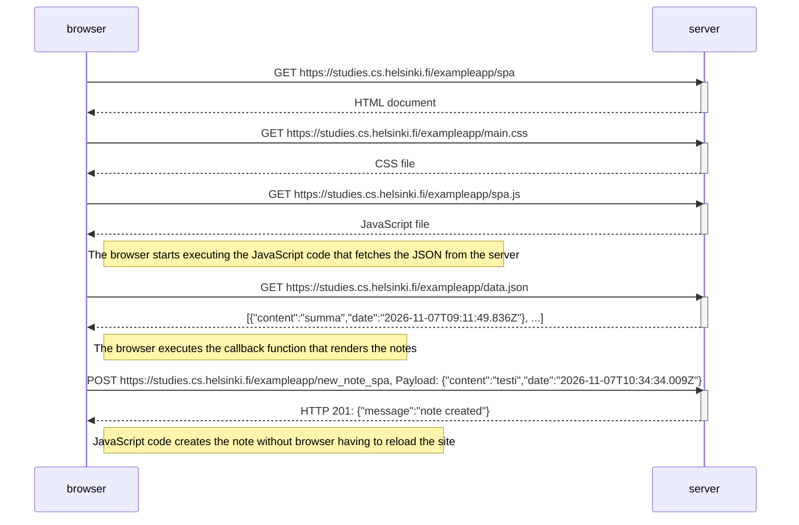

```mermaid
sequenceDiagram
    participant browser
    participant server

    browser->>server: GET https://studies.cs.helsinki.fi/exampleapp/spa
    activate server
    server-->>browser: HTML document
    deactivate server

    browser->>server: GET https://studies.cs.helsinki.fi/exampleapp/main.css
    activate server
    server-->>browser: CSS file
    deactivate server

    browser->>server: GET https://studies.cs.helsinki.fi/exampleapp/spa.js
    activate server
    server-->>browser: JavaScript file
    deactivate server    

    Note right of browser: The browser starts executing the JavaScript code that fetches the JSON from the server

    browser->>server: GET https://studies.cs.helsinki.fi/exampleapp/data.json
    activate server
    server-->>browser: [{"content":"summa","date":"2026-11-07T09:11:49.836Z"}, ...]
    deactivate server

    Note right of browser: The browser executes the callback function that renders the notes 

    browser->>server: POST https://studies.cs.helsinki.fi/exampleapp/new_note_spa, Payload: {"content":"testi","date":"2026-11-07T10:34:34.009Z"}
    activate server
    server-->>browser: HTTP 201: {"message":"note created"}
    deactivate server

    Note right of browser: JavaScript code creates the note without browser having to reload the site
```